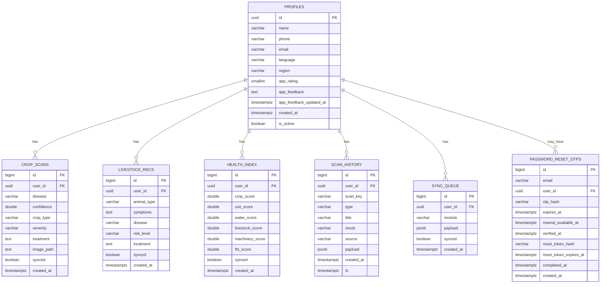

# AgroBrain360 System Design Details

## Project Overview

AgroBrain360 is a hybrid offline-first AI farm intelligence platform built to help farmers access practical agricultural support from a single mobile app. The system combines on-device AI, cloud APIs, voice interaction, offline storage, and backend persistence.

The platform is designed for real field conditions where:

- internet may be weak or unavailable
- users may prefer voice over typing
- users may need multiple services in one place
- expert agricultural help may not be immediately available

The project covers:

- crop disease detection
- crop recommendation
- fertilizer recommendation
- livestock diagnosis
- machinery assistance
- residue income analysis
- hyperlocal service discovery
- farm health index scoring
- AI advisory and voice workflows
- offline history and later sync

---

## Full System Modules

### 1. Mobile Application Layer

The Flutter app is the main user-facing layer. It provides:

- authentication and profile handling
- module navigation
- local offline storage
- on-device TFLite inference
- voice input and TTS output
- scan history and sync queue
- UI for all agricultural workflows

Important mobile areas:

- `mobile_app/lib/main.dart`
- `mobile_app/lib/routes/app_routes.dart`
- `mobile_app/lib/screens/`
- `mobile_app/lib/services/`
- `mobile_app/lib/models/`
- `mobile_app/lib/widgets/`

### 2. Backend API Layer

The FastAPI backend handles:

- authenticated profile operations
- crop, livestock, residue, and health APIs
- offline sync endpoints
- AI advisory endpoints
- voice transcription and response pipeline
- persistence to PostgreSQL

Important backend areas:

- `backend/main.py`
- `backend/routes/`
- `backend/services/`
- `backend/database/`
- `backend/schemas/`
- `backend/utils/`

### 3. Database Layer

Supabase/PostgreSQL stores:

- user profiles
- crop scan records
- livestock recommendations
- farm health index records
- scan history
- sync queue
- password reset OTP records

Important DB files:

- `database/supabase_schema.sql`
- `backend/database/models.py`
- `backend/database/crud.py`

### 4. AI / ML Layer

This layer includes both on-device and backend inference.

Models present:

- crop disease image classifier
- crop recommendation classifier
- fertilizer recommendation classifier
- livestock image model
- intent classification NLP model

Important ML folders:

- `ml_models/crop_disease/`
- `ml_models/crop_recommendation/`
- `ml_models/fertilizer_recommendation/`
- `ml_models/intent_detection/`
- `ml_models/livestock/`

### 5. Voice and LLM Layer

This layer supports:

- speech-to-text
- intent classification from speech
- advisory generation using prompt templates
- text-to-speech audio generation

Important files:

- `backend/services/voice_service.py`
- `backend/services/groq_service.py`
- `backend/services/coqui_tts_service.py`
- `backend/services/llm_service.py`
- `backend/llm/prompts/`

---

## What We Have in the Project

### Authentication and User Management

- Supabase signup and login
- token-based backend authentication
- profile upsert and fetch
- language preference storage
- app feedback and rating support
- forgot password with OTP
- offline local session fallback

Main files:

- `mobile_app/lib/services/auth_service.dart`
- `backend/routes/auth_routes.py`
- `backend/utils/auth.py`
- `backend/services/password_reset_service.py`

### Crop Module

- crop disease image scan
- crop type and area-aware ROI support
- treatment and prevention advice
- crop recommendation from soil/environment values
- fertilizer recommendation
- offline image validation before prediction
- on-device and backend prediction paths

Main files:

- `mobile_app/lib/screens/crop_module/`
- `mobile_app/lib/services/tflite_service.dart`
- `mobile_app/lib/services/image_validation_service.dart`
- `backend/routes/crop_routes.py`
- `backend/routes/fertilizer_routes.py`
- `backend/services/crop_service.py`
- `backend/services/ml_service.py`
- `backend/services/roi_service.py`

### Livestock Module

- livestock symptom-based diagnosis
- optional image-based livestock classification on mobile
- disease and risk estimation
- treatment advice
- history persistence
- fallback keyword rules when model bundle is unavailable

Main files:

- `mobile_app/lib/screens/livestock_module/`
- `backend/routes/livestock_routes.py`
- `backend/services/livestock_service.py`
- `backend/services/ml_service.py`

### Machinery Module

- machinery recommendation workflow
- maintenance risk support
- repair guidance screen
- voice-assisted interaction
- location-aware service contact support

Main files:

- `mobile_app/lib/screens/machinery_module/machinery_scan_screen.dart`
- `mobile_app/lib/screens/machinery_module/machinery_ar_guide_screen.dart`

### Residue Module

- residue scan UI
- residue type input
- moisture-aware estimation
- projected quantity estimation
- best income option recommendation
- earnings comparison
- fallback residue recommendation if crop data is missing
- schemes and supported crop endpoints
- result screen for monetization guidance

Main files:

- `mobile_app/lib/screens/residue_module/residue_scan_screen.dart`
- `mobile_app/lib/screens/residue_module/residue_income_screen.dart`
- `backend/routes/residue_routes.py`
- `backend/services/residue_service.py`

### Hyperlocal Services Module

- nearby agricultural service search
- category filtering
- search by name/specialty/address
- distance-based ordering
- offline local service fallback in app assets

Main files:

- `mobile_app/lib/screens/services_module/`
- `backend/routes/service_routes.py`
- `mobile_app/assets/data/offline_services.json`

### Farm Health Index Module

- crop, soil, water, livestock, and machinery score collection
- aggregate farm health score
- local and remote storage of latest score
- dashboard visualization

Main files:

- `mobile_app/lib/screens/health_index/`
- `mobile_app/lib/widgets/health_score_widget.dart`
- `backend/routes/health_routes.py`
- `backend/services/health_index_service.py`

### AI Assistant and Chat

- module-aware AI case chat
- prompt-driven advisory generation
- translated output
- voice-to-advice pipeline

Main files:

- `mobile_app/lib/screens/assistant_module/ai_case_chat_screen.dart`
- `mobile_app/lib/services/ai_chat_service.dart`
- `backend/routes/chat_routes.py`
- `backend/routes/llm_routes.py`
- `backend/services/chat_service.py`
- `backend/services/llm_service.py`

### Offline Storage and Sync

- Hive local storage
- user profile persistence
- scan history persistence
- sync queue
- pending record upload when internet returns
- remote history restore

Main files:

- `mobile_app/lib/services/local_db_service.dart`
- `mobile_app/lib/services/sync_service.dart`
- `backend/routes/sync_routes.py`
- `backend/database/crud.py`

### Notifications, Language, Theme, and Weather

- local notification state
- multi-language JSON assets
- theme persistence
- weather retrieval

Main files:

- `mobile_app/lib/services/notification_service.dart`
- `mobile_app/lib/services/language_service.dart`
- `mobile_app/lib/services/theme_service.dart`
- `mobile_app/lib/services/weather_service.dart`

---

## High-Level Flow

### User Request Flow

1. User opens the Flutter app
2. App loads local language, theme, user state, and TFLite models
3. User selects a module
4. Module either:
   - runs fully offline using TFLite and Hive, or
   - calls backend APIs for richer cloud support
5. Result is shown in UI
6. Data is stored locally
7. Sync service pushes pending records to backend when connectivity returns

### Backend Flow

1. Request reaches FastAPI route
2. Route validates request using schema or multipart input
3. Auth dependency verifies Supabase token if needed
4. Service layer performs business logic or model inference
5. CRUD layer persists data where applicable
6. API returns response envelope

### Voice Flow

1. User records audio
2. Mobile uploads audio to backend
3. Backend transcribes audio using Groq
4. Intent may be classified
5. LLM prompt is generated
6. Groq returns response text
7. Offline Coqui TTS may generate speech audio
8. Mobile app plays or displays response

---

## UML Class Diagram

```mermaid
classDiagram
    class AgroBrain360App {
        +build(context)
    }

    class Routes {
        +table
        +generate(settings)
    }

    class AuthSvc {
        +signUp()
        +signIn()
        +signOut()
        +requestPasswordResetOtp()
        +verifyPasswordResetOtp()
        +resetPasswordWithOtp()
        +updateLanguagePreference()
        +submitAppFeedback()
    }

    class ApiSvc {
        +saveToken(token)
        +clearToken()
        +post(url, body)
        +get(url, q)
        +multipart(url, file, fields)
    }

    class DB {
        +init()
        +saveUser(data)
        +getUser()
        +saveScan(key, data)
        +getScans()
        +addSyncRecord(module, payload)
        +pending()
        +saveFHI(data)
    }

    class SyncSvc {
        +init()
        +sync()
        +restoreHistory(limit)
    }

    class TFSvc {
        +load()
        +classifyCrop(image)
        +classifyLivestock(image)
        +predictCropRecommendation(...)
        +predictFertilizer(...)
    }

    class ImageValidationSvc {
        +validateCropDiseaseImage(image)
        +validateLivestockDiseaseImage(image)
    }

    class VoiceSvc {
        +init()
        +listen()
        +speak(text)
        +startBackendRecording()
        +stopBackendRecordingAndTranscribe()
        +stopBackendRecordingAndProcessVoice()
    }

    class LangSvc {
        +init()
        +set(code)
        +setFirst(code)
    }

    class ThemeSvc {
        +init()
        +setMode(mode)
    }

    class WeatherSvc {
        +getCurrentWeather()
    }

    class FastAPIApp {
        +lifespan()
        +root()
        +health_check()
    }

    class Settings {
        +DATABASE_URL
        +SUPABASE_URL
        +SECRET_KEY
        +allowed_origins_list
        +sqlalchemy_database_url
        +validate_production_config()
    }

    class AuthRoutes {
        +upsert_profile()
        +get_profile()
        +update_profile_feedback()
        +request_otp()
        +verify_otp()
        +reset_password()
    }

    class CropRoutes {
        +predict_crop_disease()
        +recommend_crop()
    }

    class FertilizerRoutes {
        +predict_fertilizer()
    }

    class LivestockRoutes {
        +diagnose_livestock()
    }

    class ResidueRoutes {
        +analyze_residue()
        +list_crops()
        +recommendations()
        +option_detail()
        +schemes()
    }

    class HealthRoutes {
        +compute_health_score()
        +get_latest_score()
    }

    class SyncRoutes {
        +sync_offline_records()
        +sync_history_records()
        +get_history_records()
    }

    class VoiceRoutes {
        +voice_pipeline()
        +transcribe_voice()
    }

    class LLMRoutes {
        +get_llm_advice()
        +create_realtime_session()
    }

    class ChatRoutes {
        +case_chat()
    }

    class MLSvc {
        +load_all_models()
        +predict_crop_disease()
        +predict_livestock()
        +predict_intent()
        +predict_crop_recommendation()
        +predict_fertilizer_recommendation()
    }

    class CropSvc {
        +analyze_disease()
        +recommend_fertilizer()
    }

    class LivestockSvc {
        +diagnose()
    }

    class VoiceBackendSvc {
        +transcribe_audio()
        +build_voice_prompt()
        +run_voice_pipeline()
    }

    class LLMSvc {
        +build_prompt()
        +generate()
        +create_realtime_session()
    }

    class Crud {
        +upsert_profile()
        +create_crop_scan()
        +create_livestock_rec()
        +create_health_index()
        +create_or_update_scan_history()
        +get_user_scan_history()
        +add_to_sync_queue()
    }

    class Profile {
        +id
        +name
        +phone
        +email
        +language
        +region
    }

    class CropScan {
        +id
        +user_id
        +disease
        +confidence
        +crop_type
    }

    class LivestockRec {
        +id
        +user_id
        +animal_type
        +symptoms
        +disease
        +risk_level
    }

    class HealthIndex {
        +id
        +user_id
        +crop_score
        +soil_score
        +water_score
        +livestock_score
        +machinery_score
        +fhi_score
    }

    class ScanHistory {
        +id
        +user_id
        +scan_key
        +type
        +title
        +payload
    }

    class SyncQueue {
        +id
        +user_id
        +module
        +payload
        +synced
    }

    class PasswordResetOTP {
        +id
        +email
        +user_id
        +otp_hash
        +expires_at
    }

    AgroBrain360App --> Routes
    AgroBrain360App --> LangSvc
    AgroBrain360App --> ThemeSvc
    AgroBrain360App --> TFSvc
    AgroBrain360App --> VoiceSvc
    AgroBrain360App --> DB
    AgroBrain360App --> SyncSvc

    AuthSvc --> ApiSvc
    AuthSvc --> DB
    AuthSvc --> LangSvc
    SyncSvc --> ApiSvc
    SyncSvc --> DB
    ImageValidationSvc --> TFSvc
    VoiceSvc --> ApiSvc

    FastAPIApp --> Settings
    FastAPIApp --> AuthRoutes
    FastAPIApp --> CropRoutes
    FastAPIApp --> FertilizerRoutes
    FastAPIApp --> LivestockRoutes
    FastAPIApp --> ResidueRoutes
    FastAPIApp --> HealthRoutes
    FastAPIApp --> SyncRoutes
    FastAPIApp --> VoiceRoutes
    FastAPIApp --> LLMRoutes
    FastAPIApp --> ChatRoutes

    AuthRoutes --> Crud
    AuthRoutes --> Profile
    AuthRoutes --> PasswordResetOTP
    CropRoutes --> CropSvc
    CropRoutes --> Crud
    FertilizerRoutes --> CropSvc
    LivestockRoutes --> LivestockSvc
    LivestockRoutes --> Crud
    HealthRoutes --> Crud
    SyncRoutes --> Crud
    VoiceRoutes --> VoiceBackendSvc
    LLMRoutes --> LLMSvc
    ChatRoutes --> LLMSvc

    CropSvc --> MLSvc
    LivestockSvc --> MLSvc
    VoiceBackendSvc --> LLMSvc
    Crud --> Profile
    Crud --> CropScan
    Crud --> LivestockRec
    Crud --> HealthIndex
    Crud --> ScanHistory
    Crud --> SyncQueue
    Crud --> PasswordResetOTP
```

---

## ER Diagram

---

## Data Relationships Explained

### Profiles

`profiles` is the central parent table for user-owned records.

One profile can have:

- many crop scans
- many livestock recommendations
- many farm health index records
- many scan history entries
- many sync queue records
- many password reset OTP records over time

### Crop Scans

Stores crop disease results for authenticated users.

### Livestock Recommendations

Stores livestock diagnosis outputs linked to a user.

### Health Index

Stores farm health scoring snapshots over time.

### Scan History

Acts as a generalized user history table for module activity and result payloads.

### Sync Queue

Stores records that were created offline and are waiting for synchronization.

### Password Reset OTPs

Stores OTP and reset-session lifecycle data used in password recovery.

---

## Functional Architecture Summary

### Mobile Responsibilities

- collect input
- run local inference
- store data offline
- manage local user state
- sync with backend
- present UI and workflow screens

### Backend Responsibilities

- validate and secure requests
- verify user identity
- run cloud inference and advisory logic
- persist records to database
- support sync and history restore
- provide voice and AI services

### Database Responsibilities

- keep normalized persistent user data
- maintain history and syncable records
- support profile-centric ownership
- enforce access control through RLS

### AI Responsibilities

- classify crop disease images
- recommend crops and fertilizers
- classify intents
- assist livestock diagnosis
- generate advisory text and speech responses

---

## Key Strengths of the Design

- offline-first architecture is a major practical advantage
- mobile and backend are clearly separated
- real ML artifacts are integrated into the product
- sync model supports low-connectivity usage
- voice and local language support improve accessibility
- Supabase plus FastAPI is a strong combination for hackathon-to-product growth

## Current Design Limitations

- some modules are fully implemented while others are partly heuristic
- livestock flow is split across multiple logic styles
- static service data limits real-world scale
- some mobile screens are too large and should be decomposed
- secure local storage can be improved
- stronger migration, logging, and test coverage would help production readiness

---

## Final Conclusion

AgroBrain360 already has the structure of a serious end-to-end intelligent agricultural platform. It is not only a UI demo or only a model demo. It includes:

- mobile client
- backend API
- PostgreSQL data model
- offline-first local state
- model training assets
- deployed inference path
- voice AI path
- sync architecture

The diagrams above represent the current project structure well enough for:

- documentation
- hackathon presentation
- viva explanation
- technical report submission
